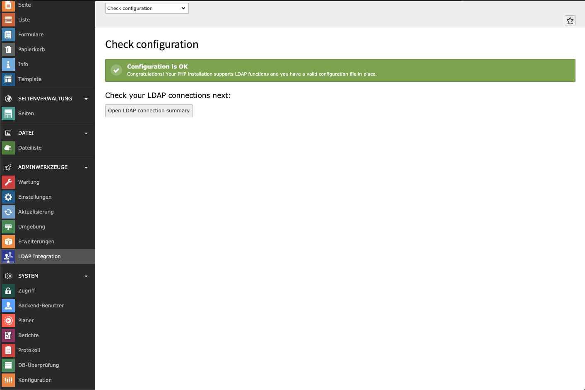
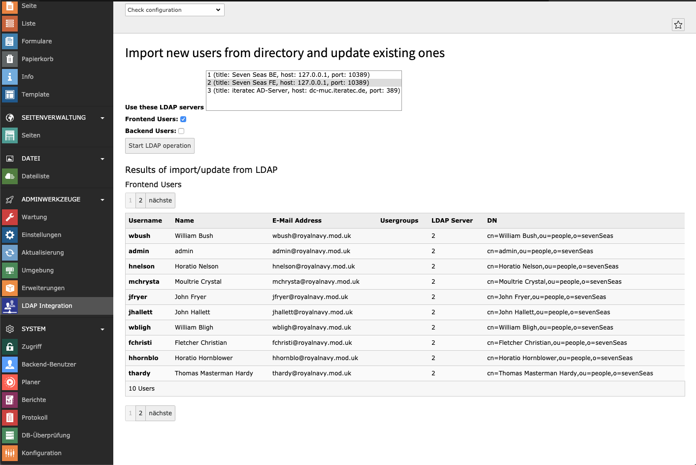

.. include:: ../Includes.txt

.. _introduction:

============
Introduction
============

.. _what-it-does:

What does it do?
================

This extension allows TYPO3 to connect to LDAP directories and to fetch user records from them.
Features include:

* Handling of multiple LDAP servers
* Storage of LDAP server configurations in the TYPO3 database or a configuration file
* Import/Update/Delete of frontend (FE) and backend (BE) users
* Import of user groups
* Flexible mapping of LDAP attributes to TYPO3 user properties
* Authentication of FE and BE users against the directory
* Usage of the TYPO3 scheduler to import/update/delete TYPO3 users

.. attention::
   
   Currently it's not possible to import or update users automatically during login.

.. _screenshots:

Screenshots
===========

   Backend module, check view

The backend module starts with a check view to make sure your configuration is syntactically correct.

   Backend module, import/update user records

You can import users, update them or remove stale records. The list schows the most important attributes for checking purposes.
